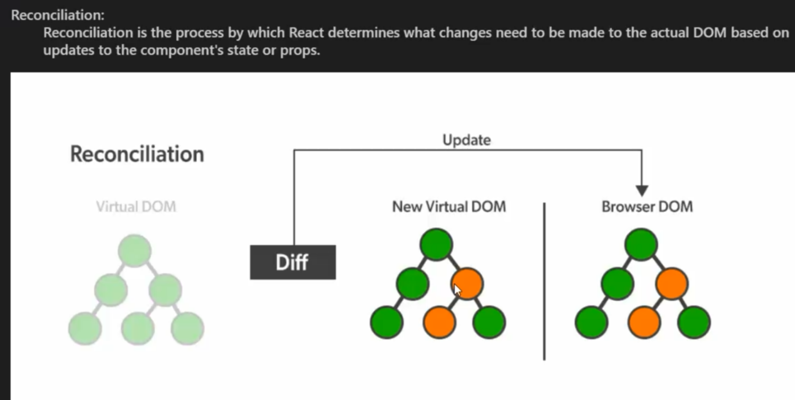

https://github.com/PriyaDev04/DailyReact.git
npm create vite@latest my-react-app
npx create-react-app my-react-app
npm run dev
-React is a JavaScript library used to build user interfaces (UI) — especially for single-page applications.
Jordan Walke,2011 used internally in fb later in 2013 open source officially released.
-It was created by Facebook (now Meta).
React helps you:
-Build reusable components
-Update UI without reloading page
-Manage data easily
-Build fast & scalable apps
1. component
-Reusable building blocks.
-A component is just a JavaScript function that returns UI.
2.JSX
-JSX = JavaScript + HTML
-You can write HTML inside JavaScript.
Rules:
-Must return one parent element
-Use {} to write JS inside JSX
3.Props (Passing Data)
-Props = Data passed from parent to child.
4.State(Dynamic Data)
-State makes your UI interactive.
5.Virtual DOM
-imaginary DOM- a light weight copy of actual DOM
-React doesn’t update the full page.
-It updates only the changed part using Virtual DOM →whenever changes happens it creates a new V DOM and am 
-Reconciliation is the process where React compares the previous Virtual DOM with the new Virtual DOM and updates only the changed elements in the real DOM.
-The diffing algorithm is the process React uses to compare the previous Virtual DOM with the new Virtual DOM efficiently and determine what needs to be updated in the real DOM.
Reconciliation-->Full process of updating UI
Diffing Algorithm--->The comparison logic used inside reconciliation

6.How React Works (Simple Flow)
-Component renders
-State changes
-React re-renders only updated part
-UI updates automatically

Benefits

1.Fast Performance (Virtual DOM)
* React uses a Virtual DOM to compare changes and update only necessary parts of the real DOM.
-Faster UI updates
-Better performance

2.Declarative UI 
* React is declarative,Declarative UI means you describe what the UI should look like, and React handles how to update it.You don’t manually change the DOM.
-Cleaner code
-Less manual DOM manipulation
-Fewer bugs
-Easy to understand
Example mindset:
“If state is true → show this.
If false → show that.”
You don’t control the DOM manually.

3.Component-Based Architecture
* React apps are built using reusable components.
Example:
Navbar
Card
Button

Benefits:
Reusable code
Easy maintenance
Scalable applications

4.Reusability
* Same component can be reused with different props.

5.One-Way Data Flow
* Data flows from parent ➝ child.
Makes debugging easier
Predictable behavior

6. Strong Ecosystem & Community
* Maintained by Meta Platforms.
Huge community support:
Libraries
Jobs
Tools
Documentation

7.Cross-Platform Development
* Using React Native, you can build mobile apps using React concepts.
-Web + Mobile skills = High deman

8.SEO Friendly (With SSR)
* With frameworks like Next.js, React supports Server-Side Rendering.

Better SEO
Faster initial load

------------------------------------------------------------------------------------------------
React is fast due to Virtual DOM, declarative which makes UI predictable and easy to manage, component-based for reusability, and supported by a strong ecosystem.
------------------------------------------------------------------------------------------------
React itself is CSR by default.
But React can support SSR using frameworks like Next.js.

nodemodules- All dependencies and sub dependencies downloaded for our project
package.json--all information about package like which dependencies and their version
package-lock.json-- dependencies and subdencies version and other in details

in index.html
  

  

  so in main.jsx if u go, we got the id=root, so this main.jsx is the root file and from here only react project get started

  createRoot(document.getElementById('root')).render(
  <StrictMode>
    <App />
  </StrictMode>,
)

createRoot---In virutal DOM one root is getting ready in ---> document.getElementById('root')
then it will render it means whatever in app.jsx

in app.jsx we will render all our componenets

rafce
React Arrow Functional Component Export

ES7+ React/Redux/React-Native snippets
(dsznajder)

Tailwind CSS IntelliSense

if suggestion not shown while naming componenet then just go that coponenet and come back and give ctrl+space then it will give suggestions

Babel---is a transpiler which convert modern JS(ES6) and JSX ito backward compatible JS that browser understand.

In react projects Babel is used for

* convert JSX----> Javascript
* Convert ES6+features---->Es5
* Apply experimental JS 

Babel works
1. parsing
It reads your code and converts it into something called an AST (Abstract Syntax Tree).

Think of AST like:
Code → Tree Structure → Understandable format

2. Transforming
Babel plugins modify the AST.

Example:
Arrow functions → normal functions
JSX → React.createElement()
Modern syntax → old syntax

3. Generating

Babel converts the modified AST back into JavaScript code.
Modern JS → AST → Transform → Old JS → Output

-----------------------------------------------------------------------------------------A compiler converts code from one language to another completely different language (usually lower-level).
Example: C++ → Machine Code
A transpiler converts code from one version of a language to another version of the same language.
Example:
Modern JavaScript (ES6) → Older JavaScript (ES5)
An interpreter executes code line by line at runtime.
It does NOT convert the entire program into machine code first.

Simple Definitions (Interview Ready)
Compiler → Converts whole program into machine code before running.
Interpreter → Executes program line by line.
Transpiler → Converts same language to different version.

-----------------------------------------------------------------------------------------

In JSX, special characters can be used using HTML entities, JavaScript expressions inside curly braces, or Unicode values.
&gt;  ---->html entities

{}---it is a javascript expression
{{margin right:10px}}--first is JS expression, second is object ,inside key and pair followedy lowercael case
-----------------------------------------------------------------------------------------

What is StrictMode in JSX?

React StrictMode is a special wrapper component that helps you detect potential problems in your app during development.

It does NOT affect production build.

consol.log appear twice in development not in production
It intentionally runs some functions twice in development.

Example:

useEffect

Component render

This helps find bugs early.

so StrictMode is a development tool in React that helps identify potential problems by running extra checks and warnings without affecting production. 
-----------------------------------------------------------------------------------------

npm install tailwindcss @tailwindcss/vite 